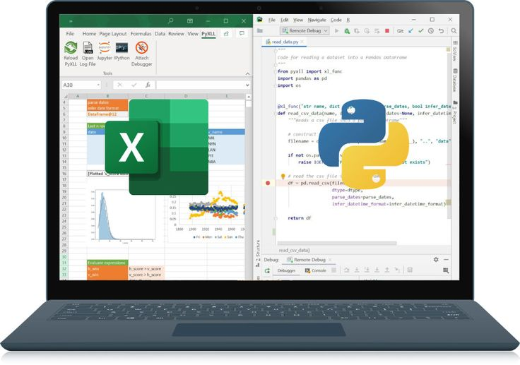

> ## **Objetivo:** Atualizar a planilha do excel e enviar por email 
_____________________________________________________________


<font color = 'grey'>Descrição do processo e trabalho feito:</font>
 
 - Todos os dias há uma grande demora na execução da criação da planilha do excel e atrasos no envio por email, onde nela contém diversas informações e são consolidadas em formas de relatórios extremamente importante para área de negócio. São geradas através de Macros VBA e entregues ao gestor.
 
  - O problema inicial é que mesmo tendo muitos códigos para gerar esta planilha automática e enviar para o gestor, há um tempo considerável processando tudo e deve ser feita diáriamente, entregue para o gestor no primeiro horário, resultando em uma pessoa ter que chegar mais cedo, todos os dias de 12 á 20 minutos e executar/rodar as macros e enviar para o gestor, se tudo der certo.
  
  - De forma a resolver o problema primeiro até conseguir passar todos os dados para uma ferramenta mais robusta ideal como o Tableau e Power bi, foi desenvolvido este código para atender a necessidade do gestor e evitar que tenha hora extra.
 
 - Há códigos em VBA na planilha usada como objeto principal, onde faz diversos processos de atualizações, como puxar dados de outras planilhas e portal CRM via navegador web, portanto neste script não haverá detalhamento desta parte. Somente a execução da macro vba 'click' usando python e envio por email para o gestor.

 - # Instalações necessárias
 - #### Neste script estou usando o anaconda e ao final é salvo em .py embora o jupyter notebook possua diversos pacotes e bibliotecas incluso é necessário instalar algumas para esta mini-tarefa.
```
!pip install pyautogui    # Para controlar seu pc
!pip install pywin32      # Para controlar programas no pc como outlook
```
```
# Imports

import pyautogui                    # Para controlar o pc 
import time                         # Tempo de execução específico                    
import pyperclip
import os                           # Para navegar e interagir com diretórios 
import webbrowser                   # Para controlar o navegador
import win32com.client as win32     # Para controlar programs no pc

```
```
webbrowser.open_new('https://site')

# Esperar
time.sleep(3)

# Localização por coordenadas x,y
pyautogui.moveTo(210,475, duration = 0.25)
pyautogui.click(210,475, button = 'left', duration = 0.25)

time.sleep(4)

# Abrir a pasta/planilha excel
os.startfile(r"C:\Users\elvis.monteiro\Desktop\Teste para envio fora de perfil\Fora do Perfil - Atualização Diária 2021.xlsb")

pyautogui.PAUSE=6

#Executar macro do excel
pyautogui.click(62,296)

# Esperar 15 minutos (tempo em segundos)
time.sleep(900)

#Fechar planilha
pyautogui.hotkey('alt','f4')

#Esperar a planilha fechar e salvar automaticamente(Já com programação para salvar direto por vba)
time.sleep(5)
```


# Enviar por email
```
# Import

import win32com.client as win32
```
```
#Criar integração com o  outlook
outlook = win32.Dispatch('outlook.application')

# Criar um email
email = outlook.CreateItem(0)

#configurar informações de email - email exemplo
email.To = " emailexemplo1@.com;emailexemplo2@.com.br" 
email.Subject ="Assunto"

email.HTMLBody = """
<p>Olá, Bom dia ! Segue em anexo a planilha XYZ atualizada 2021.</p>

<p>Att 

Elvis M.</p>

"""
#Enviar Anexo
anexo = r"C:\Users\elvis.monteiro\Desktop\Teste para envio fora de perfil\Fora do Perfil - Atualização Diária 2021.xlsb"
email.Attachments.Add(anexo)

email.Send ()
print ("email enviado")
```
# Start da Execução

    1 - Este Script é feito no Jupiter Notebook e salvo em formato .py. Sistema Operacional usado Windows.
    
    2 - É usado o agendador de tarefas para iniciar o processo automático dentro do horário estipulado no computador.(Talvez seja necessário acesso root da máquina).

    3 - Basta criar uma basta no agendador de tarefas nomeando a tarefa e subindo o script .py.

# Fim

### Links e Referências

https://pyautogui.readthedocs.io/en/latest/

